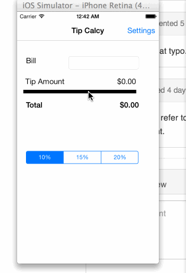

TipCalculator
=============

This is a basic Tip calculator Application
This is an IOS demo application for Tip Calculator Application. This application allows user to enter the amount spent and calculates the Total amount that the user needs to pay based on the tip percentage.

There is a settings view where the user can set the default tip percentage.

Time spent: 3 hours spent in total

Completed user stories:

Notes:
1. Basic Tip calculator funtionality
2. Settings button action, Settings View
3. Optional : WIP setting page interaction with Tipcontroller view page
4. 
Spent some time making the resolving simulator crash issue

Walkthrough of all user stories:

GIF created with [LiceCap](http://www.cockos.com/licecap/).
